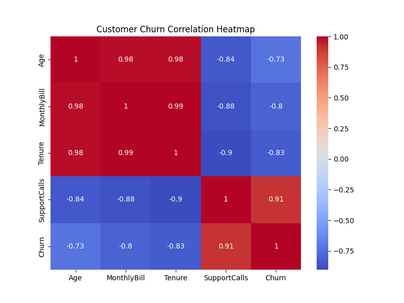

# Customer Churn Prediction

## Project Overview :-

In this project, I built a Machine Learning model to predict whether a customer is likely to leave a company (churn) or stay. The project uses customer information such as age, monthly bill, tenure, and support calls to make predictions.

This project helped me understand classification problems, train-test split, Random Forest, feature importance, confusion matrices, and data visualization using heatmaps.

## Dataset Features :-

The dataset contains the following features:

* Age
* MonthlyBill
* Tenure
* SupportCalls
* Churn (Target Variable)

## Technologies Used :-

* Python
* Pandas
* Scikit-Learn
* Matplotlib
* Seaborn

## Machine Learning Workflow :-

1. Loaded and explored the dataset.
2. Converted the Churn column from text values (Yes/No) into numerical values using Label Encoding.
3. Split the dataset into training and testing data.
4. Trained a Random Forest Classifier.
5. Made predictions on unseen test data.
6. Evaluated model performance using Accuracy Score and Confusion Matrix.
7. Analyzed feature importance.
8. Created a correlation heatmap for data visualization.

## Results :-

* Model Accuracy: 75%
* Successfully predicted customer churn using machine learning techniques.
* Generated a confusion matrix to evaluate predictions.
* Visualized relationships between features using a heatmap.

## Correlation Heatmap :-

This heatmap shows the correlation between customer attributes and churn behavior.

## What I Learned :-

Through this project, I learned:

* Classification using Machine Learning
* Random Forest Classifier
* Train-Test Split
* Label Encoding
* Accuracy Score
* Confusion Matrix
* Feature Importance
* Correlation Heatmaps

This project was created as part of my Data Science learning journey and helped me understand how machine learning can be used in real-world business problems such as customer retention and churn prediction.
